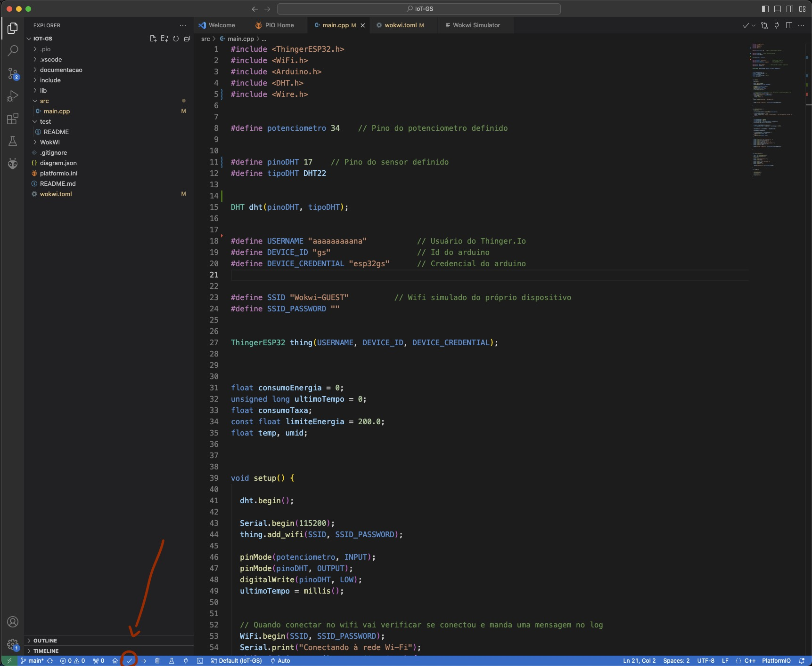
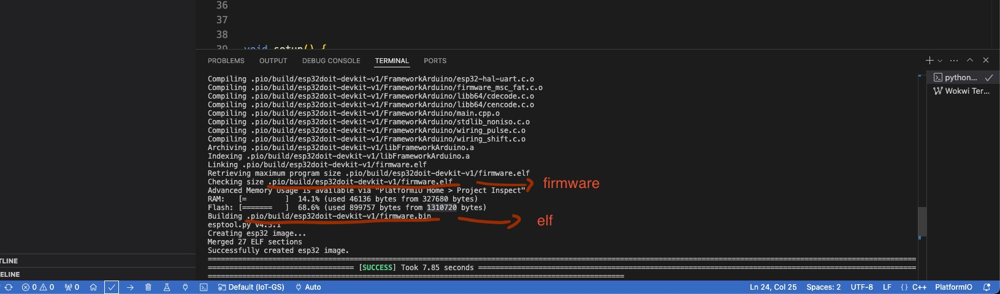
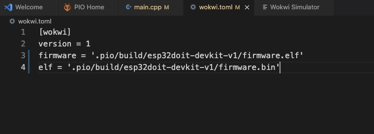

 

# Sobre o Projeto
SolarTracker é a plataforma digital que te coloca no controle da sua energia solar, oferecendo monitoramento em tempo real para quem já possui placas solares, revelando como pode economizar e contribuir para um desenvolvimento mais sustentável através de gráficos durante os meses. Já para pessoas que ainda não possuem placas solares, terá cálculos personalizados de acordo com o consumo de kW mensal, comparando o custo da energia costumeira com a economia que você terá com placas solares e ajudar na transição para um futuro mais sustentável.

 

# Funcionalidade do IoT 
O arduino coleta dados de consumo de energia da residência e transmite para o aplicativo, gerando gráficos intuitivos para comparar o consumo de energia costumeira com o da energia das placas solares e veja o impacto positivo da energia solar na conta de luz.

 

# Instruções

## Abrindo o projeto
1. Clone o repositório no VS Code.
2. Instale a extensão PlatformIO e WokWi no VS Code.
3. No projeto, vá para o src e abra para acessar o código. 
4. Com as extensões baixadas, compile o projeto apertando no check no canto inferior esquerdo.
    
   
    
6. Vá para o arquivo wokwi.toml.
7. Mude o que está dentro do firmware e elf para o que apareceu no terminal com final .bin para o elf e .elf para o firmware.
    
   
    
   
9. Aperte ctrl + shit + p e procure Wokwi Start simulation ou para mac aperte cmd + shit + p.
10. Rodar o Iot e testá-lo.

 
